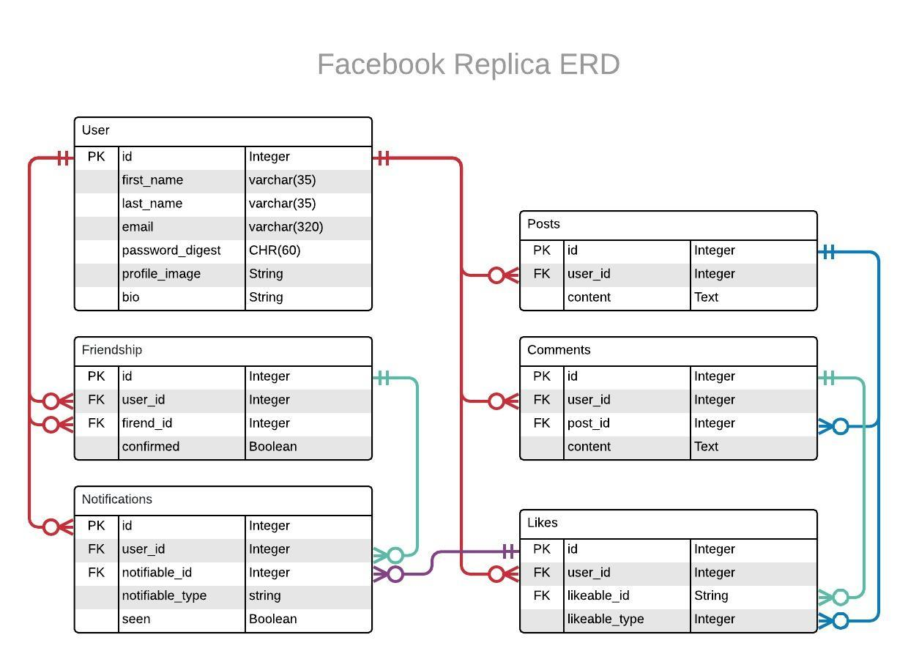

# Facebook Replica

This is an excercise building a clone of some of Facebook's features using Ruby on Rails.

## Live Demo

[Check a live version on Heroku](https://facebook-replica.herokuapp.com)
  
## Features

- **Users**
  - Sign-up / login / logout.
  - Show profile page.
  - Create / update / delete posts.
  - Has many posts.

- **Posts**
  - Create / update / delete.
  - Show in chronological update order.
  - Belongs to a User.

- **Comments**
  - Create / update / delete.

- **Likes**
  - Like / unlike comments and/or posts.

- **Friendships**
  - Send / Accept a friend request.
  - Remove existing friends.
  - Feed with posts from yourself and friends only.

- **Notificaions**
  - Recieve a notification for :
    - Comments on your posts.
    - Likes for your comments / posts.
    - Friendship requests and acceptance.

## Entity Relationship Diagram (ERD)



## Local Installation

### Requirements

- Ruby       '~>2.6.0'
- Bundler    '2.0.0'
- Rails      '~> 5.2.3'
- Postgresql '>= 0.18', '< 2.0'

### Getting Started

Clone the repo and then install the needed gems:

```console
 bundle install --without production
```

Create and Migrate the database:

```console
 rails db:create
 rails db:migrate
```

Populate the database [Optional] :

```console
 rails db:seed
```

Setup your Omniauth App [Optional] :

```console
 bundle exec figaro install
```

open the  config/application.yml and enter yout APP_ID and APP_SECRET, for example:

```yaml
facebook_app_id: '5346435734534'
facebook_app_secret: '*********************'
```

You'll be ready to run the app in a local server:

```console
 rails server
```

Visit <http://localhost:3000/>
